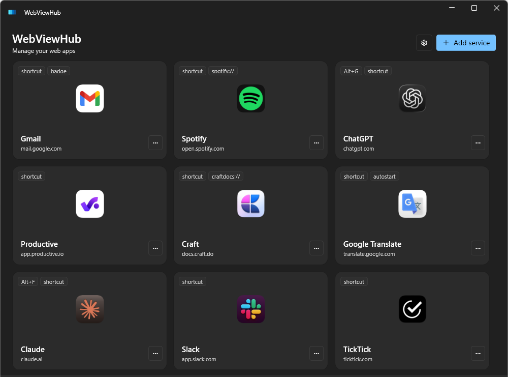

# WebViewHub

Run web apps as native Windows windows — each in its own window, with its own
tray icon, hotkey and login session. Built on WebView2, so there is no bundled
Chromium: the app reuses the Edge runtime that ships with Windows.



> **Status:** personal project, published as-is. It works well enough for daily
> use, but there is no installer, no release pipeline and no support promise.
>
> **Vibe coded.** This was built by prompting an AI (Claude), with the design
> decisions, testing and review done by hand. It reads like that in places —
> heavy comments, uneven idiom, more explanation than a human would leave
> behind. The behaviour it describes has been verified against a real 15-service
> setup, but treat the code as what it is: a working personal tool, not a
> reference implementation. Corrections are welcome.

## Why

Wrapping a handful of web apps (Slack, Gmail, ChatGPT, Spotify…) usually means
running an Electron-based hub, and every one of those carries its own copy of
Chromium. WebViewHub leans on WebView2 instead — one shared browser runtime,
already present on Windows 10/11 — which keeps the install small and the
memory footprint proportional to the pages you actually have open.

## Features

**Windows, not tabs.** Every service gets a real window with its own taskbar
entry, tray icon and position. Peek mode hides a window as soon as it loses
focus, so a global hotkey turns any service into a quick overlay.

**Multiple accounts per service.** Each service can hold several profiles —
separate cookie jars, separate logins. Switch between them from the gear menu
in the title bar. Useful when the site itself has no account switcher.

**Global hotkeys.** Bind a shortcut per service to toggle its window. There is
also a double-Ctrl+C trigger that opens a translator with whatever you just
copied.

**Unread badges.** Parse the page title with a regex to pull out an unread
count, then render it on the tray icon and as a taskbar overlay.

**Per-service custom CSS.** Inject your own stylesheet, optionally only in dark
mode. Handles UserCSS syntax (`@-moz-document`, `@var`) so styles from
userstyles.world mostly work as-is.

**Native-looking icons.** Icons are fetched from the site, WebCatalog or
macOSicons, then normalised: transparent borders cropped, squircle mask
applied, multi-frame `.ico` generated so Windows can pick a DPI-matched frame.

**Portable.** Config, logs, icons and browser profiles all live in `Data/` next
to the executable. Nothing is written to `%APPDATA%` or the registry, apart
from the optional autostart entry and protocol registrations you enable
yourself.

## Requirements

- Windows 10 1809 or newer
- [.NET 8 Desktop Runtime](https://dotnet.microsoft.com/download/dotnet/8.0)
- WebView2 Runtime — preinstalled on Windows 11 and current Windows 10;
  otherwise available from
  [Microsoft](https://developer.microsoft.com/microsoft-edge/webview2/)

## Build

```powershell
git clone https://github.com/YuriiHaidur/webviewhub.git
cd webviewhub
dotnet build WebViewHub.csproj -c Release
```

The executable lands in `bin/Release/net8.0-windows/WebViewHub.exe`. Run it
from there — it creates `Data/` alongside itself on first launch.

Tests:

```powershell
dotnet test WebViewHub.Tests/WebViewHub.Tests.csproj
```

## How it fits together

| Area | Where |
|---|---|
| Startup, single-instance, WebView2 environment | `App.xaml.cs` |
| Window lifecycle, hub, profile switching | `Services/WindowManager.cs` |
| Per-service window, WebView2 host, tray icon | `Windows/ServiceWindow.xaml.cs` |
| Config model and per-service settings | `Models/Models.cs` |
| Icon fetch, normalisation, `.ico` generation | `Helpers/IconHelper.cs`, `Services/FaviconService.cs` |
| Global hotkeys, low-level keyboard hook | `Services/HotkeyManager.cs`, `Services/LowLevelKeyboardHook.cs` |

Services are isolated by WebView2 *profile*: one shared
`CoreWebView2Environment` with a per-profile `ProfileName`, so cookies and
storage never cross between services or between accounts of the same service.

## Notable constraints

A few things in the code look odd until you know why:

- **`ProfileName` is fixed when the WebView2 controller is created.** Switching
  accounts therefore rebuilds the window rather than swapping the session in
  place.
- **WebView2 is an `HwndHost`.** WPF cannot draw above it, so overlay dialogs
  are separate windows — a `ContentDialog` centred over the page renders
  *behind* it while still capturing input.
- **The low-level keyboard hook needs its own thread and a non-blocking
  logger.** A blocking write inside the hook callback makes Windows drop
  keystrokes system-wide.
- **`SetForegroundWindow` alone is refused** when the process lacks foreground
  privilege; activation goes through the `AttachThreadInput` workaround.

## Built with

[WPF-UI](https://github.com/lepoco/wpfui) for Fluent controls,
[WebView2](https://developer.microsoft.com/microsoft-edge/webview2/) for the
embedded browser, and [H.NotifyIcon](https://github.com/HavenDV/H.NotifyIcon)
for tray icons.

## License

[MIT](LICENSE)
